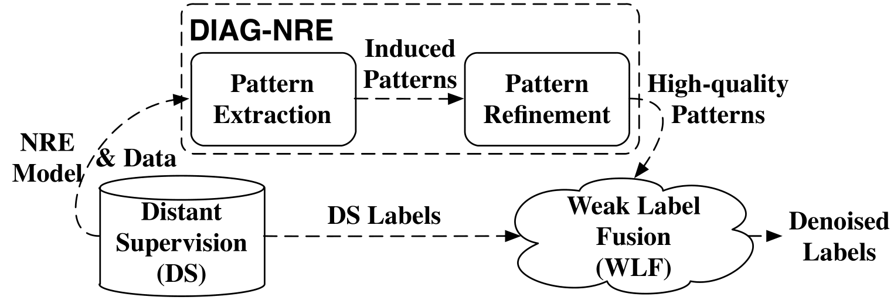
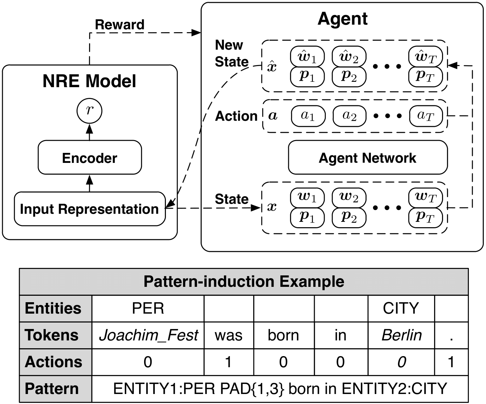
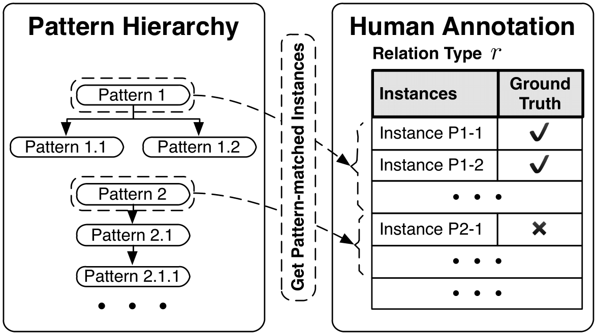

# DIAG-NRE
Source code for ACL 2019 paper "DIAG-NRE: A Neural Pattern Diagnosis Framework for Distantly Supervised Neural Relation Extraction".


## Overview

<p align='center'>
    
</p>

DIAG-NRE aims to establish a bridge between Distant Supervision (DS) and Weak Label Fusion (WLF)
for Neural Relation Extraction (NRE), which generally contains two key stages:
- **Pattern Extraction**, generating patterns automatically based on reinforcement learning (RL);
- **Pattern Refinement**, refining patterns with the help of human annotations on a small set of actively selected instances.

Advantages of DIAG-NRE include:
- denoising distantly supervised labels with reduced human skill requirements;
- enabling quicker generalization to new relation types;
- interpreting which features neural models have learned.
- interpreting from what kinds of noises the target relation type suffers.


## Citation

If you find our work interesting, you can cite the paper as

```text
@inproceedings{zheng2019diagnre,
               title={DIAG-NRE: A Neural Pattern Diagnosis Framework for Distantly Supervised Neural Relation Extraction},
               author={Zheng, Shun and Han, Xu and Lin, Yankai and Yu, Peilin and Chen, Lu and Huang, Ling and Liu, Zhiyuan and Xu, Wei},
               booktitle={ACL},
               year={2019}
}
```


## Setup

1. Run `conda env create --file=environment.yml`
to prepare a basic python environment.

2. Then, when starting a fresh shell, please run the following codes first.
```bash
# activate the conda env
source activate diag-nre
# set proper environment variables, including 'PATH', 'PYTHONPATH', 'WORK_DIR', etc.
source ./shell/set_env.sh
```

`set_env.sh` will help to set proper environment variables, and create `logs` and `model` directories when needed.


## Data Preparation

We have preprocessed the [NYT](http://iesl.cs.umass.edu/riedel/ecml/) dataset and
the [UW](https://www.cs.washington.edu/ai/gated_instructions/naacl_data.zip) as mentioned in the paper.

1. Download our preprocessed data collection associated with human diagnostic annotations,
[base_data.zip](https://drive.google.com/open?id=1CpCqlwDjVmLlu9bUYRb3yyrl5WeBF7zn),
into the current directory.

2. Run the following codes to prepare well-formatted data for subsequent model training
```bash
unzip base_data.zip
cd base_data
# 'WORK_DIR' will be set properly after executing 'source ./shell/set_env.sh'
python prepare_data.py $WORK_DIR
```


## DIAG-NRE

###  0. Training NRE Models

Run `python batch_train_rel.py`, then the program will
automatically bind idle gpus and train NRE models for all 14 relations.

### 1. Pattern Extraction

<p align='center'>
    
</p>

Run `python batch_train_agent.py`, then the program will
train pattern-extraction agents for all 14 relations
by interacting with well-trained NRE models.

### 2. Pattern Refinement + Weak Label Fusion (WLF)

<p align='center'>
    
</p>

Run `python batch_train_diag.py`, then the program will
- conduct the pattern refinement based on human diagnostic annotations;
- produce denoised training labels by fusing multiple weak supervision sources;

Here, we already provide our annotations based on the actively selecting process described in the paper.

For users who need to apply DIAG-NRE to other data,
you can extract instances to be annotated from the pattern hierarchy file,
named as 'rule_hierarchy_model{}.pkl'.

Example codes to check the pattern hierarchy
```Python
# load hierarchy
import pickle
with open('rule_hierarchy_file_path', 'rb') as fin:
    pattern_hierarchy = pickle.load(fin)

# print hierarchy
from rule_helpers import print_rule_hierarchy
print_rule_hierarchy(pattern_hierarchy)
```

Note that, in this code, the term 'rule' shares the same notion with the term 'pattern' used in the paper.

### 3. Retraining & Evaluation

Run `python batch_retrain_rel.py` to retrain multiple NRE models
with different random seeds for all kinds of labels.

Run `python batch_eval_total.py` to aggregate all evaluation results.


## File Specifications

### Log

- **log.rel**XXX, the log for NRE model training
- **log.agent**XXX, the log for agent network training and pattern generation
- **log.diag**XXX, the log for the pattern refinement
- **log.eval_total**XXX, the log for the final total evaluation

### Model

- **erasure_policy_model**XXX, the checkpoint of the agent network;
- **rel_model**XXX, the checkpoint of the NRE model;
- **train_erasure_decision_model**XXX, the pickled file for agent's decisions;
- **rule_info_model**XXX, the pickled file storing pattern information derived from certain decision files;
- **rule_hierarchy_model**XXX, the pickled file storing the constructed pattern hierarchy merged from multiple pattern information sources.


